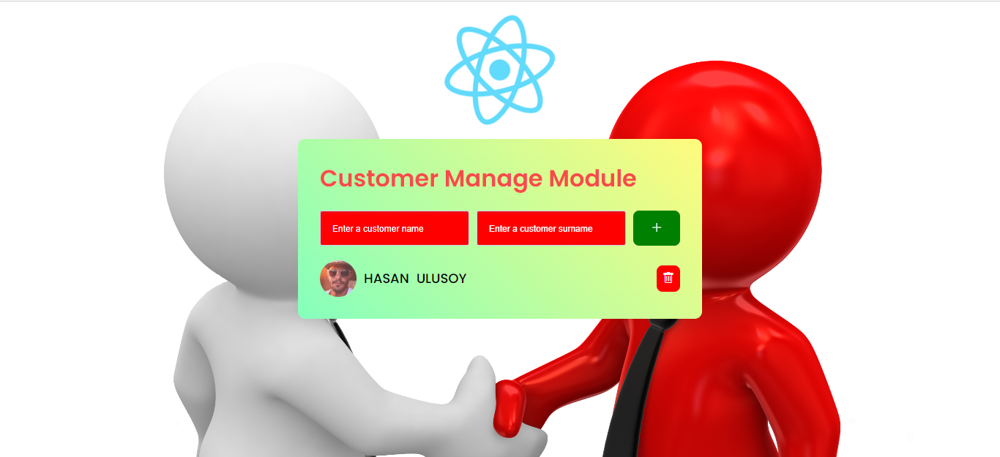

### React Project 2
# Customer Manege Module 

#### Bu çalışmada
- Müşteri ekleme ile ad ve soyadı bilgisi ile bir obje oluşturuldu.
- Oluşturulan obje ekrana yansıtıldı.
- Müşteri ekleme ad ve sayad girişleri ile duyarlı hale getirildi.
- Random image ile müşteri profiline image eklendi.
- Müşteri silme butonu işlevsel hale getirildi.

- Random image : https://i.pravatar.cc/300

## Preview

# Getting Started with Create React App

This project was bootstrapped with [Create React App](https://github.com/facebook/create-react-app).

## Available Scripts

In the project directory, you can run:

### `npm start`

Runs the app in the development mode.\
Open [http://localhost:3000](http://localhost:3000) to view it in your browser.

# Customer-Manege-Module-React
